# 💎 AI DermalScan - Advanced Facial Aging Sign Detection & Age Estimation

**AI DermalScan** is a deep learning–based web application that detects **facial aging signs** such as *wrinkles*, *dark spots*, and *puffy eyes*, while also estimating the **approximate age** of the person using a fine-tuned **DenseNet121** model.  
The app is built with **Streamlit** for an intuitive and modern user interface.

---

## 🚀 Features

✅ Real-time **Face Detection** using OpenCV Haar Cascade  
✅ Accurate **Aging Sign Classification** (`clear face`, `darkspots`, `puffy eyes`, `wrinkles`)  
✅ Logical **Age Estimation** based on detected facial condition  
✅ **Streamlit-based UI** with dark gradient theme  
✅ **Downloadable Results** – annotated image + prediction CSV  
✅ **Automatic CSV Logging** of all predictions  
✅ Average **processing time under 5 seconds**

---

## ⚙️ Project Structure

```bash
AI_DermalScan/
│
├── Documentation/
│   └── Naman Kapoor(AI_DermalScan) Documentation.pdf
├── Naman Kapoor(AI_DermalScan).ipynb    # Model training & experimentation notebook
├── test_images/                         # Sample test images                 
├── app.py                               # Streamlit frontend (UI + interaction)
├── backend.py                           # Model loading & prediction logic
├── haarcascade_frontalface_default.xml  # Face detector
├── requirements.txt                     # Dependencies
├── prediction_log.csv                   # Auto-generated prediction records
└── README.md                            # You are here
```
---

## 🧠 Model Overview

| Parameter | Details |
|------------|----------|
| **Base Architecture** | DenseNet121 (Transfer Learning) |
| **Input Size** | 224 × 224 pixels |
| **Optimizer** | Adam |
| **Loss Function** | Categorical Crossentropy |
| **Framework** | TensorFlow / Keras |
| **Augmentation** | Rotation, Zoom, Flip, Shift |

---

## 🏗️ Project Architecture
### 🔹 High-Level Architecture

```mermaid
flowchart LR
    A(["🧍 User Uploads Facial Image via Streamlit UI"]) --> B(["🎨 Frontend (app.py)"])
    B --> C(["⚙️ Backend (backend.py)"])
    C --> D(["🧩 Image Preprocessing using OpenCV"])
    D --> E(["📸 Face Detection (Haar Cascade Classifier)"])
    E --> F(["🧠 DenseNet121 Model Prediction"])
    F --> G(["📊 Output: Aging Sign + Confidence + Age"])
    G --> H(["🖼️ Annotated Image + DataFrame Creation"])
    H --> I(["🌐 Streamlit Visualization"])
    I --> J(["⬇️ Download Options\n(Annotated Image + CSV Log)"])

     A:::main
     B:::process
     C:::process
     D:::process
     E:::process
     F:::process
     G:::process
     H:::process
     I:::output
     J:::output
    classDef main fill:#00e6ac,stroke:#ffffff,stroke-width:2px,color:#000,font-weight:bold
    classDef process fill:#1b1f24,stroke:#00e6ac,stroke-width:2px,color:#fff,font-weight:bold
    classDef output fill:#2c5364,stroke:#00e6ac,stroke-width:2px,color:#fff,font-weight:bold
```

### 🔹 Low-Level Architecture

```mermaid
flowchart LR
    A(["🖼️ Input: Uploaded Image (NumPy Array)"]) --> B(["🎞️ Convert to Grayscale\n(cv2.cvtColor)"])
    B --> C(["👁️ Face Detection\n(Haar Cascade Classifier)"])
    C --> D(["✂️ Crop Detected Face Region (ROI)"])
    D --> E(["📏 Resize to 224×224"])
    E --> F(["⚙️ Normalize Pixel Values (0–1)"])
    F --> G(["🧠 DenseNet121 Model Prediction"])
    G --> H(["🔢 Extract Predicted Class & Confidence"])
    H --> I(["📅 Estimate Age (Rule-Based randint Logic)"])
    I --> J(["🟩 Draw Bounding Box & Overlay Labels"])
    J --> K(["📄 Store Results in Pandas DataFrame"])
    K --> L(["✅ Return Annotated Image + Predictions + Latency"])

     A:::input
     B:::process
     C:::process
     D:::process
     E:::process
     F:::process
     G:::model
     H:::model
     I:::process
     J:::process
     K:::process
     L:::output
    classDef input fill:#00e6ac,stroke:#ffffff,stroke-width:2px,color:#000,font-weight:bold
    classDef process fill:#1b1f24,stroke:#00e6ac,stroke-width:2px,color:#fff,font-weight:bold
    classDef model fill:#2c5364,stroke:#00e6ac,stroke-width:2px,color:#fff,font-weight:bold
    classDef output fill:#00e6ac,stroke:#ffffff,stroke-width:2px,color:#000,font-weight:bold
```


---

## 🧩 Tech Stack

| Layer | Technology |
|--------|-------------|
| **Frontend** | Streamlit |
| **Backend** | TensorFlow / Keras |
| **Detection** | OpenCV Haar Cascade |
| **Data Handling** | Pandas, NumPy |
| **Visualization** | Matplotlib, Streamlit |
| **Logging** | CSV via Pandas |

---

## ⚙️ Setup & Installation 

### 1️⃣ Clone the Repository 
```bash
git clone -b Naman https://github.com/Springboard-Mentor-DermalScan/AI-DermalScan.git
cd AI-DermalScan
```
### 2️⃣ Create and Activate Virtual Environment(Recommended)
```bash
python -m venv dermalscan_env

# 👉 For Windows
dermalscan_env\Scripts\activate

# 👉 For macOS/Linux
source dermalscan_env/bin/activate
```
### 3️⃣ Install All Required Dependencies
```
pip install -r requirements.txt
```
### 4️⃣ Download the Trained Model File 
Download the pretrained model file DenseNet121_best_model.h5 from the following link:
```
https://bit.ly/4qy5UJj
```
Once downloaded, place it inside your project root directory:
```
AI_DermalScan/
│
├── DenseNet121_best_model.h5
```
### 5️⃣ Ensure Haar Cascade File Exists for Face Detection
This file is used by OpenCV to detect faces before classification.
The required file 'haarcascade_frontalface_default.xml' is already included.

### 6️⃣ Run the Streamlit Application
```
streamlit run app.py
```
The application will automatically open in your browser:
```
http://localhost:8501
```
You can now upload an image → get real-time predictions → download results.

### 7️⃣ Test Images(Optional) 
After the Streamlit app is running, you can test with sample images provided in:
```
AI_DermalScan/test_images/
Files include:
  test1.jpg
  test2.jpg
  test3.jpg
  test4.jpg
```
Upload these from the Streamlit sidebar to validate the model output.

### 8️⃣ View Prediction Logs(Optional)
Every prediction is automatically saved to:
prediction_log.csv
You can open this file in Excel or any CSV viewer to see:
 Timestamp, Filename, Bounding_Box, Predicted_Sign, Confidence, Estimated_Age

✅ Setup Complete!
You are now ready to explore AI DermalScan’s facial aging sign detection.

---

## 🖼️ Output Screenshots

Below are examples of the system’s end-to-end functionality:


The model successfully identifies visible facial aging signs and overlays bounding boxes with predicted class, confidence score, and estimated age.

---

## 👥 Contributors

- **Intern:** Naman Kapoor  
- **Mentor:** Praveen (Infosys Springboard)

